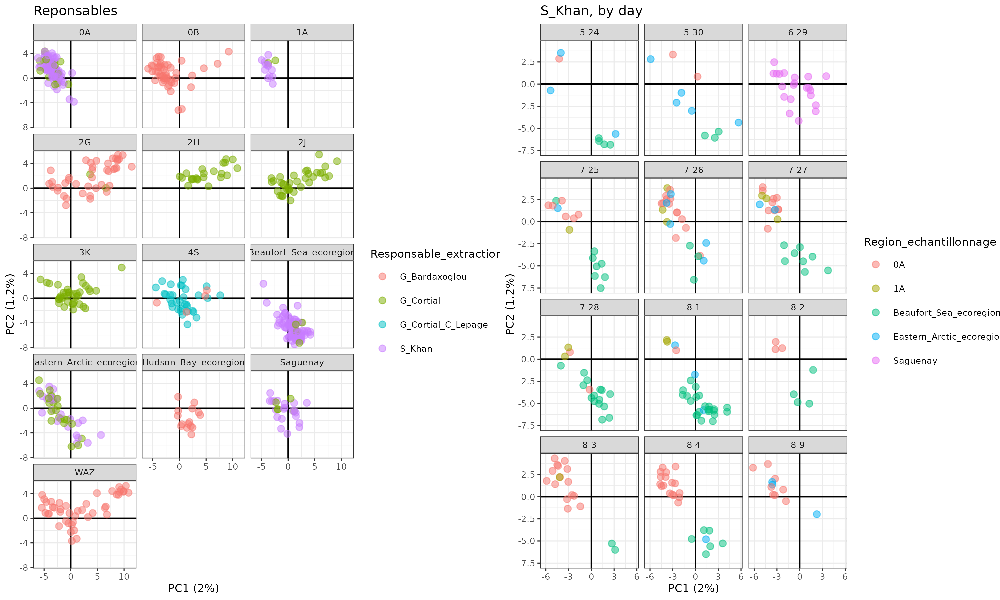
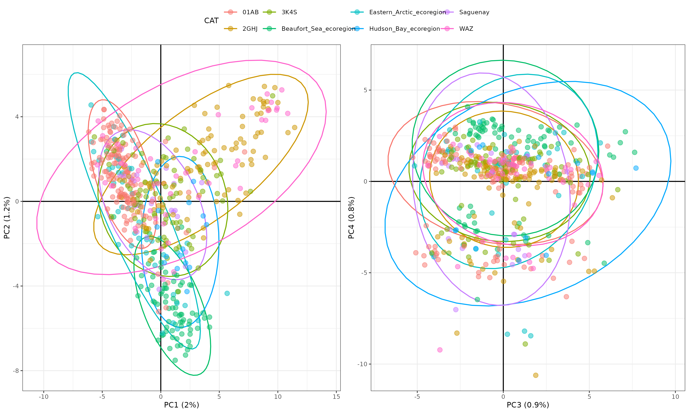
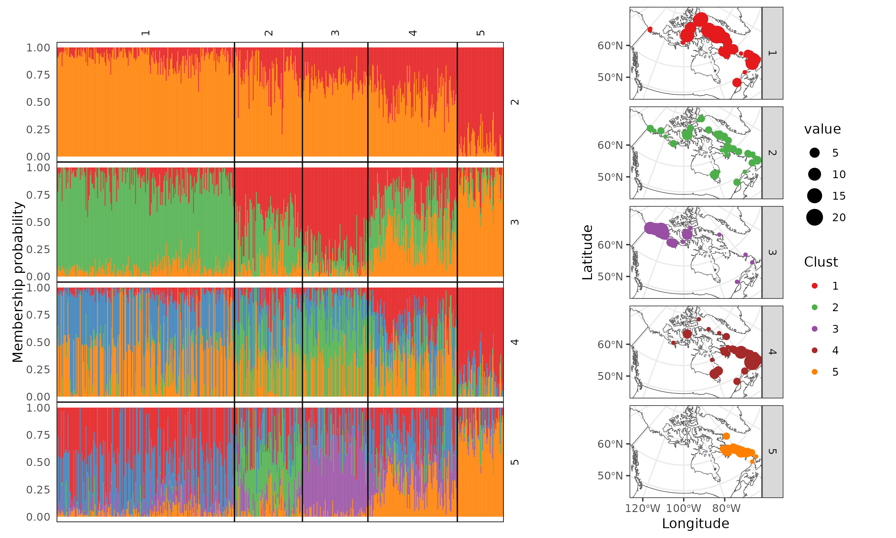

# Boreogadus_ddRADseq_2022
ddRADseq on 500 Boreogadus


__Main author:__  Audrey Bourret  
__Affiliation:__  Fisheries and Oceans Canada (DFO)   
__Group:__        Laboratory of genomics   
__Location:__     Maurice Lamontagne Institute  
__Affiliated publication:__  
__Contact:__      e-mail: audrey.bourret@dfo-mpo.gc.ca


- [Objective](#objective)
- [Summary](#summary)
- [Status](#status)
- [Contents](#contents)
  + [Subsections within contents](#subsections-within-contents)
- [Methods](#methods)
  + [Subsections within methods](#subsections-within-methods)
- [Main Results](#main-results)
- [Requirements](#requirements)
- [Caveats](#caveats)
- [Uncertainty](#uncertainty)
- [Acknowledgements](#acknowledgements)
- [References](#references)


## Objective
- Check population structure 

## Summary
Description of the project, provide some background and context. What are the inputs and outputs?


## Status
In-development


## Contents
### Folder structure

```
.
├── 00_Data                 # Main datasets are here (large files are stored locally)
├── 01_Code                 # R Scripts for the different analysis
├── 02_Results              # Figures and main output results
└── README.md
```

### Main scripts 

#### 02_Discovered_SNPs.R

Main script to obtain a first catalog of SNPs through STACKS. An older version of the script (02_Discovered_SNPs_2:30:10_old.R) using less longer reads was used in the first attempts to work on this dataset, but was later abandoned. 

#### 03c_Filter_SNPs_10X_2024.R

Main script to perform the first round of filtration, up to a SNPs panel with 1 SNP / locus, still with Arctogadus and hybrids individuals. Older version of the script (03a_Filter_SNPs_5X_2023.R and 03b_Filter_SNPs_10X_2023.R) were used in previous version of the pipeline.

#### 99_RADsex.R

Script to run the external program RADsex, aiming to identify sexualluy biased zone in the genome.  An older version of the script (99_RADsex_2:30:10_old.R) using less longer reads was used in the first attempts to work on this dataset, but was later abandoned. 


## Methods
### SNP panels

**OLDER - Main catalog 2:30:10**

- 6 librairies of 96 samples = 576, sequenced on 1 lane of NovaSeq 150 PE
- Remove Illumina adaptor with Trimmomatic using 2:30:10  
- Demultiplex with process_radtag module, 2 restriction enzymes (*pstI* & *mspI*)), truncation at 135 pb, filter-illumina, clean, rescue and check quality options
- Align on *GadMor3 (Gadus morhua)* reference genome. Did some tests with a B. saida assembly. The % alignment was lower (91% vs 98%) but in the end a similar number of SNPs was genotyped (test on 26 individuals). 
  - Keep only those with > 96% alignment (574- remove 2 samples)
- Stacks v2.64 (stacks)
  - The catalog was made with the full dataset (574 samples)
  - **807,969** loci, effective per-sample coverage: mean=27.8x, stdev=14.7x, min=2.7x, max=94.8x

**Final main catalog**

- 6 librairies of 96 samples = 576, sequenced on 1 lane of NovaSeq 150 PE
- Remove Illumina adaptor with Trimmomatic using 2:30:10:8:FALSE to keep all reads in both R1 and R2 
- Demultiplex with process_radtag module, 2 restriction enzymes (*pstI* & *mspI*)), truncation at 90 pb, filter-illumina, clean, rescue and check quality options
- Align on *GadMor3 (Gadus morhua)* reference genome. 
  - Keep only those with >10,000,000 and <250,000,000 reads mapped (566 - remove 10 samples)
- Stacks v2.64 (stacks)
  - The catalog was made with the full dataset (566 samples)
  - **1,046,093** loci, effective per-sample coverage: mean=28.9x, stdev=13.6x, min=5.1x, max=73.3x

**Final SNPs panel**

  - Keep only samples with mean min coverage = 10x (532 samples)
  - Populations (stacks)
      - Parameters: R = 0.75 overall, min MAF = 0.01
      - Kept 84,220 loci and 227,766 snps
  - Remove missing values (individuals and SNPS)
      - VCFtools - 0.1.17
      - Few individuals with more than 30% missing values, remove duplicated individuals, choosing the replicate with the less missing data 
      - X SNPs with more than 10% missing values
      - After filtration : 191,0001 snps from 526 individuals
  - HW desequilibrium by sampling location - not performed
      - Instead, remove X loci with He > 0.6 
  - Each SNPs depth - Remove a few SNPs with too low or high median coverage (< X and X105, 2 times SD, approx. 1-99% percentile)
      - Remove  SNPs (x snps from x individuals)
  - Batch effect by plate with an RDA - NS
  - Check relatedness
      - With VCFtool, relatedness2
      - Remove x pairs of samples with relatedness > 0.3 (~0.45, so clearly duplicates)
      - final : X individuals
      - 9 individuals with relatedness << 1 , also outliers within a PCA (first axis = 40%). mtDNA analysis suggested Arctogadus glacialis.
  - Keep only 1 snps by RADloc (FIRST ONE), new MAF 0.01 
      - **53,384 snps from 522 individuals, including 9 Arctodagus + 3 potential hybrids**


**High quality SNPs panel**

  - Keep only samples with mean min coverage = 10x (516 samples)
  - Populations (stacks)
      - Parameters: R = 0.75 overall, min MAF = 0.01
      - Kept 56,001 loci and 219,003 snps
  - Remove missing values (individuals and SNPS)
      - VCFtools - 0.1.17
      - 1 individual with more than 10% missing values (it's maybe an Arctogadus), remove duplicated individuals, choosing the replicate with the less missing data 
      - 40,929 SNPs with more than 10% missing values
      - After filtration: 178,074 snps from 511 individuals
  - HW desequilibrium by sampling location - not performed
      - Instead, remove X loci with He > 0.6 
      - After filtration: 177,445 snps from 511 individuals
  - Each SNPs depth - Remove a few SNPs with too low or high median coverage (< 10 and >95, max = 2 times SD, approx. 1-99% percentile)
      - Remove 3188 SNPs 
      - After filtration: 174,257 snps from 511 individuals)
  - Check batch effet with an RDA: non-significant (P = 0.117)
  - Check relatedness
      - With VCFtool, relatedness2
      - Remove 2 pairs of samples with relatedness > 0.25 (>0.45, so clearly duplicates)
      - final : 3398 individuals
      - 9 individuals with relatedness << 1 , also outliers within a PCA (first axis = 40%). mtDNA analysis suggested Arctogadus glacialis.
  - Keep only 1 snps by RADloc (FIRST ONE), new MAF 0.01 (some were fixed)
      - **38,131 snps from 507 individuals, including 9 Arctodagus + 2 potential hybrids**


## Main Results

**Preliminary results in brief**

- 9 individuals that looks like another species,to be confirmed
  - From RDA loci on mtDNA, it is possible that some hybrid exist
- Potential misidentification of extraction : no strong evidence based on PCA. Talk with Greg about it.

|  |
|---| 
| Exploration PCA with lab metadata. | 


- Population structure: 3 groups evident, up to 5 based on Admixture and SnapClust

|  |
|---| 
| PCA. ~ 3 groups, Beaufort, Eastern Arctic, Labrador |


On PC3 and PC4, evidence of chromosomal inversion? What are the consequences on other analyses?

|  |
|---| 
| Admixture. k = 5, introgress group? |


  
